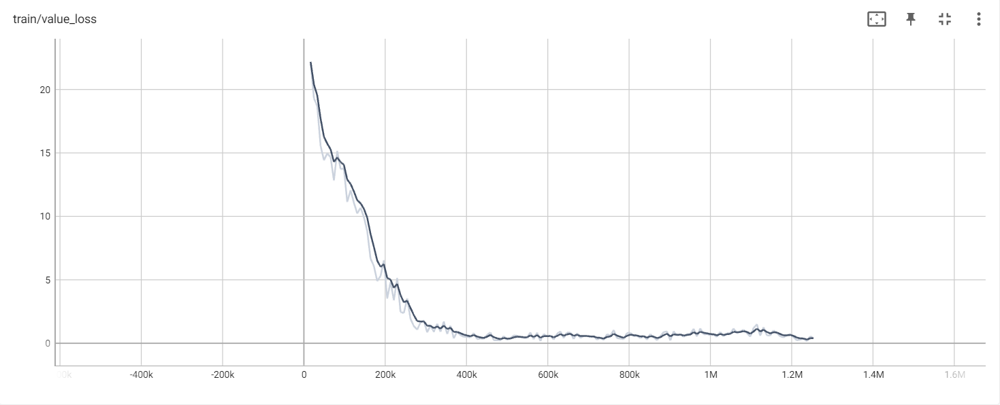
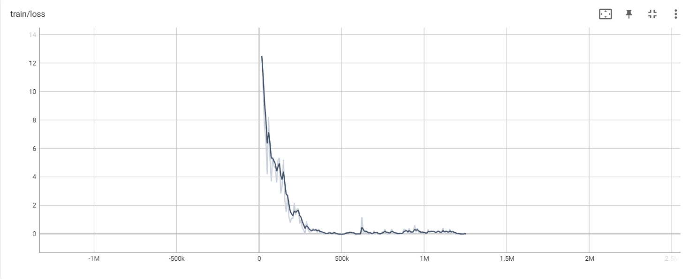
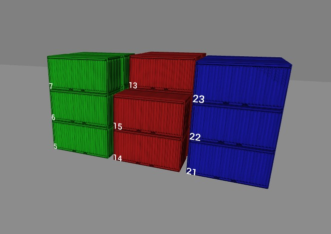
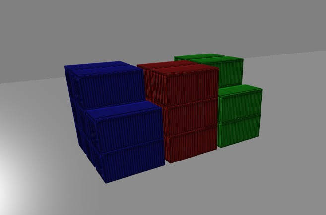
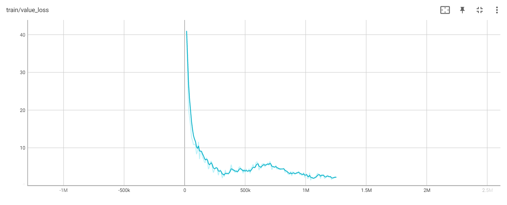
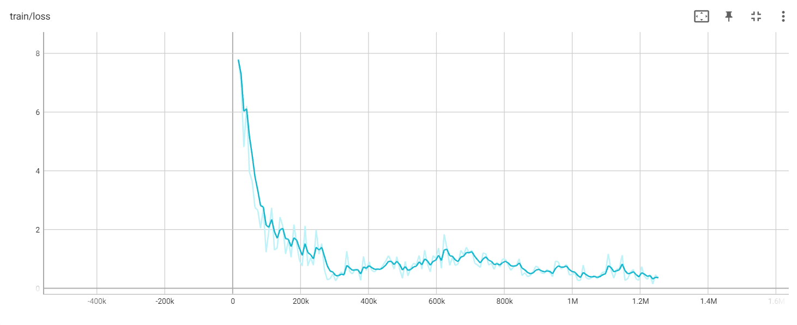
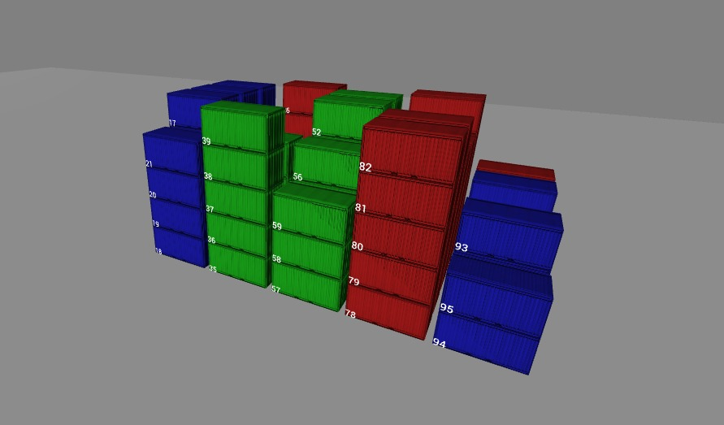
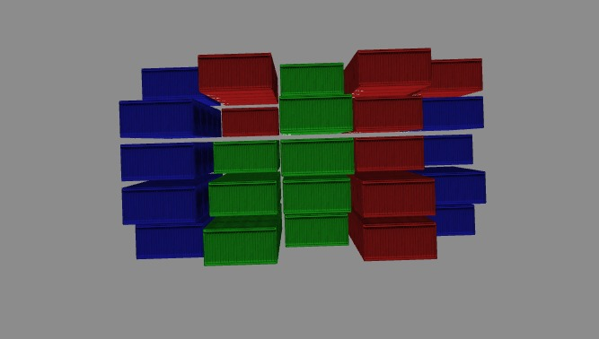

# Portfolio Applied Data Science

Bonno Nieuwenhout 19122381 groep 1

## 1. Inleiding

Ik heb van 29 augustus 2022 t/m 3 februari 2023 de minor Applied Data science gevolgd.
Ik heb dit op de Haagse Hogeschool in Den Haag gedaan en heb samen met mijn groepsgenoten hierbij twee projecten mogen doen.
We hadden de keuze tussen verschillende projecten waarbij we de eerste 6 weken aan het project van FoodBoost hebben gezeten.
Vervolgens hebben we ervoor gekozen om nog een periode van 4 weken hier verder aan te werken om onze oplossing beter te maken.
Na deze 4 weken hebben we vervolgens 2 keer 4 weken lang aan het project van Cofano gewerkt.
Hier hebben we uiteindelijk onze paper over geschreven en daarom zal ik over dit onderwerp wat meer vertellen.

Ik ben begonnen aan deze minor, omdat ik graag een nieuwe tak wilde leren van programmeren.
Ik had al kennis over object oriented programming, maar wilde graag leren hoe machine learning werkt en hoe ik dat zelf kon ontwikkelen.
Ik ben erg tevreden met de ontwikkeling die ik dit halfjaar heb gemaakt en kan met trots terugkijken op wat ik heb ontwikkeld.

### 1.1 Inhoud
In dit portfolio is te lezen wat ik tijdens mijn minor applied data science heb geleerd en hoe ik mijn vaardigheden heb ontwikkeld. 
Elk hoofdstuk is opgedeeld in het project voor FoodBoost en het project voor Cofano.

### 1.2 FoodBoost
Voor het project van FoodBoost moest er gekeken worden naar het helpen van mensen in het ontwikkelen van een gezonder diet met behulp van machine learning. 
Het doel van het machine learning was dat een gebruiker minder moeite hoeft te doen om een gerecht te vinden dat gezond is en binnen zijn of haar smaak valt. 
Zo kan de gebruiker gezonder eten en toch genieten van het voedsel.

### 1.3 Cofano
Voor het project van Cofano was de probleemstelling het optimaliseren van terminalprocessen. 
Schepen kunnen lange tijd wachten om in- of uitgeladen te worden en dat kost geld. 
De strekking was dus het maken van een reinforcement learning model dat bepaalde processen hiervan kon versnellen.

## 2. Kennis en Literatuur

Ik zal in dit hoofdstuk vertellen over de kennis die ik heb opgedaan en wat ik geleerd heb over data science.

Om te beginnen heb ik kennis opgedaan door de datacamp opdrachten te maken.
Daarnaast heb ik de lectures bijgewoond en deze stof tot mij genomen.
Vervolgens heb ik met deze kennis gewerkt aan de projecten waar ik gaande weg nog meer heb geleerd over data science.
Tijdens het programmeren leer je namelijk over steeds meer data science onderwerpen doordat je opzoek gaat naar oplossingen voor je probleem.

### 2.1 FoodBoost
Met het project van FoodBoost hebben we een supervised machine learning model ontwikkeld.
Dit model zou op basis van aangegeven gerechten voor 1 categorie kunnen aangeven welke mogelijke recepten je nog meer lekker zou vinden.

Bij het supervised machine learning model hebben we gekozen om een classifier toe te passen.
Deze classifier zou de gerechten beoordelen op wel of niet lekker.
Hierbij heb ik geleerd over wat een aantal classifiers inhouden. Om ons model te testen hebben we ook gekeken naar hoe verschillende classifiers presteren.
Er is namelijk niet één classifier die je altijd kan gebruiken. We hebben moeten onderzoeken welke classifier het meest geschikt was om ons probleem op te lossen.
Hierdoor heb ik kennis gedaan over KNN, Logistic Regression, Multinomial Naive Bias, Decision Tree en Random Forest classifiers.

Verder hebben we alle data gesimuleerd. Ik heb geleerd hoe dit gedaan moest worden en vervolgens toegepast

### 2.2 Cofano

#### Inleiding

Met het project van Cofano hebben we ons bezig gehouden met Reinforcement Learning.
We zijn 4 weken later begonnen aan dit project, dus we hebben daarvoor al via de andere groepen geleerd over het project.

Meden door de gesprekken met Jeroen Vuurens hebben we besloten om ook RL te gebruiken voor ons probleemdomein.
Hiervoor hebben we ons moeten verdiepen in wat reinforcement learning inhoud, hoe je het kan toepassen en hoe je het kan opbouwen.
We hebben gekeken naar een aantal voorbeelden. Een paar voorbeelden om te begrijpen hoe het is gemaakt en een ander aantal dat al meer overlapping zou hebben met ons probleemdomein.

#### Stable baselines 3
Om ons te helpen hebben we gebruik gemaakt van een bekend framework, genaamd [stable-baselines3](https://stable-baselines3.readthedocs.io/en/master/), voor RL. Dit framework heeft ons veel tijd en moeite bespaard, omdat we veel dingen hierdoor zelf niet hoefde te bouwen.
Om een RL toe te passen kan je gebruik maken van [gym](https://www.gymlibrary.dev/). Met gym kan je RL environments bouwen.
Deze environments kunnen gebruikt worden voor SB3. De RL modellen die SB3 aanbied werken namelijk op basis van deze environments.
Door een RL model van SB3 onze environment mee te geven en het model vervolgens te trainen, krijgen we een RL model dat ons probleemdomein kan oplossen.

Bij het gebruik maken van SB3 heb ik veel geleerd over het [PPO](https://stable-baselines3.readthedocs.io/en/master/modules/ppo.html) en [A2C](https://stable-baselines3.readthedocs.io/en/master/modules/a2c.html) RL model. 
Ik heb hierbij naar de documentatie gekeken van de modellen en geleerd over de principes over hoe de modellen te werk gaan.

Om kennis op te doen hoe het maken van een environment werkt hebben we gekeken naar voorbeelden online en video's op youtube.
Ook heb ik gekeken naar de voorbeelden die op SB3 staan. Deze voorbeelden zijn kort van code en goed gedocumenteerd waardoor ze goed te lezen en begrijpen zijn.
In deze link staan een aantal [voorbeelden](https://stable-baselines3.readthedocs.io/en/master/guide/examples.html)

#### Multiprocessing

Als je het trainen van je model snel wilt versnellen kom je al snel aan bij multiprocessing.
Ik heb dit toegepast in mijn code voor het trainen van het model.
Met multiprocessing kan je gebruik maken van de cores van de cpu.
Hierdoor kan je niet sequentieel trainen, maar parallel.
Dit houd in dat je bijvoorbeeld 4 yards tegelijk aan het invullen bent.
Het PPO model kan hiervoor worden gebruikt en d.m.v. multiprocessing kan het PPO razendsnel leren.
Waar ik helaas wel achter kwam is dat er met multiprocessing er geen reward score meer te zien is, aangezien er meerdere rewards parallel lopen.
Deze is daarom niet terug te zien bij de grafieken van het model zelf.

#### Maximaal aantal timesteps

In dit [paper](https://arxiv.org/abs/1712.00378) is te lezen dat het bijhouden van een maximale step counter en dit te gebruiken voor bij RL belangrijk is.
Dit heb ik uiteindelijk ook toegepast en heb later de penalty voor buiten de yard weggehaald.

## 3. Jupyter notebooks

In dit hoofdstuk laat ik zien wat ik heb geprogrammeerd voor beide projecten.
Hoe ik data heb gesimuleerd en hoe ik de modellen heb ontwikkeld. 
Er zijn veel iteraties over de code heengegaan en heb veel dingen continue lopen aanpassen. Hierdoor zijn er veel stukken code die dezelfde functie hebben.
Ik heb daarom alleen de laatste versies benoemd van wat ik heb ontwikkeld, aangezien het is geïtereerd op voorgaande code.

### 3.1 FoodBoost

#### 3.1.1 Simulatie

We hebben de data die we nodig hadden allemaal gesimuleerd. Hiervoor heb ik classes aangemaakt om deze data in op te slaan.
Om dit voor het testen overzichtelijk te houden heb ik een aantal dingen opgesplitst.
Het maken van de users en het maken van de benodigde matrix heb ik in afzonderlijke notebooks gedaan.

- [User class](https://github.com/BonnoNieuwenhout/ADS_Minor_Portfolio/blob/4f5b4fe33937a2b2e9a5c52969cf305aba453dce/notebooks/FoodBoost/UserClass.ipynb)
- [Algemene utils](https://github.com/BonnoNieuwenhout/ADS_Minor_Portfolio/blob/4f5b4fe33937a2b2e9a5c52969cf305aba453dce/notebooks/FoodBoost/Utils.ipynb)
- [Create users](https://github.com/BonnoNieuwenhout/ADS_Minor_Portfolio/blob/4f5b4fe33937a2b2e9a5c52969cf305aba453dce/notebooks/FoodBoost/CreateUsers.ipynb)
- [Create matrix](https://github.com/BonnoNieuwenhout/ADS_Minor_Portfolio/blob/4f5b4fe33937a2b2e9a5c52969cf305aba453dce/notebooks/FoodBoost/CreateLooV1DataMatrix_compare_tags.ipynb)

#### 3.1.2 Classifiers

Ik heb een utils class en een dto class geschreven zodat ik het testen van de classifiers overzichterlijker kon doen.

- [Classifier utils](https://github.com/BonnoNieuwenhout/ADS_Minor_Portfolio/blob/4f5b4fe33937a2b2e9a5c52969cf305aba453dce/notebooks/FoodBoost/ClassifierUtils.ipynb)
- [Classifier dto](https://github.com/BonnoNieuwenhout/ADS_Minor_Portfolio/blob/4f5b4fe33937a2b2e9a5c52969cf305aba453dce/notebooks/FoodBoost/ClassifierResultDto.ipynb)

#### 3.1.3 Testen

Om uiteindelijk de gesimuleerde data te gebruiken en de classifiers te testen op de matrixen heb ik een aparte notebook gemaakt.
Hierin wordt de matrix aan de classifiers gegeven en vervolgens wordt er per classifier een score bepaald.
De data voor elke classifier wordt in een tabel gezet en deze vervolgens weergegeven.
In deze tabel staan de scores van elk model zodat kan worden vergeleken welk model het beste is.

Ik data op een aantal manieren getest. Deze zijn hieronder op een rij gezet

- [1 tegen 1](https://github.com/BonnoNieuwenhout/ADS_Minor_Portfolio/blob/1b95f351b9b07a29ee626f82c092d484aeeeac17/notebooks/FoodBoost/Test-Classifiers-With-LooV1-Compare-Tags-1on1-Specific.ipynb)
- [1 tegen n](https://github.com/BonnoNieuwenhout/ADS_Minor_Portfolio/blob/1b95f351b9b07a29ee626f82c092d484aeeeac17/notebooks/FoodBoost/Test-Classifiers-With-LooV1-Compare-Tags-1onN-Specific.ipynb)
- [n tegen n](https://github.com/BonnoNieuwenhout/ADS_Minor_Portfolio/blob/1b95f351b9b07a29ee626f82c092d484aeeeac17/notebooks/FoodBoost/Test-Classifiers-With-LooV1-Compare-Tags-NonN-Specific.ipynb)

Verder heb ik ook heat maps gemaakt om de resultaten vanuit de tabellen wat meer overzichtelijk te maken.
Hieronder zijn een aantal heatmaps te zien en de daarbij behorende notebooks.

!!!!!!!!!!!!!!!!!!!!!!!!!!!!!!!!

### 3.2 Cofano

Ik heb eerst geïtereerd van een vollere yard naar een lege yard. Echter, Ik kwam erachter dat dit uiteindelijk niet ten goede kwam voor het model.
Door scores te vergelijken zag ik dat het model beter presteerde als het model altijd vanaf een lege yard begon.
Dit kan komen doordat de functie die ik heb geschreven voor het invullen van de yard het een sub-optimale state geeft voor het model.
Naar mijn verwachting werkte het invullen van de yard dus niet ten goede voor het model. Ik heb dit daarom uiteindelijk niet meer gebruikt.
Dit had geen invloed op de 3 bij 3 bij 3 yard, maar ik zag wel negatieve invloeden zodra het probleemdomein groter werd.

Omdat de complexiteit van het probleem sterk kan toenemen naarmate de yard van het probleemdomein groter word, heb ik het model eerst getraint op een 3 bij 3 bij 3 yard.
Nadat ik had ondervonden dat het model dit probleem goed kon oplossen heb ik gekeken in hoeverre ik de grootte kon opschalen.
Aangezien ik de input voor de grootte van de yard variabel heb gemaakt was dit gemakkelijk aan te passen.
Echter, dit betekende niet meteen dat het model in staat was om dit op te lossen. Ik ben simpelweg de waardes van de input voor het environment gaan tweaken
om te kijken hoever ik kon komen zonder verder aanpassingen te doen. Zowel de 3x3x3 als het grootste resultaat zijn hieronder te zien in de visualisatie.

#### 3.2.1 Environment

Het environment dat ik heb gebouwd zal ik hier in het kort beschrijven.
Zoals eerder is benoemd is het bijhouden en handhaven van een maximaal aantal timesteps belangrijk.
Alhoewel er een maximaal aantal steps is toegevoegd zit, bleef het wel van belang om een penalty uit te delen als de agent een container te hoog wilt plaatsen.
Anders zal de agent niet alle containers plaatsen, want ook niet de bedoeling is.

##### 3.2.1.1 Action en observation space

Verder bestaat de action space uit een x en y waarde. De observation is een dictionary met de volgende items:

- Volgende schipnummer van de container dat geplaatst wordt
- De state van de yard waarin de containers worden geplaatst
- Het maximaal aantal stappen dat gezet kan worden
- Het huidige aantal stappen dat gezet is
- Een lijst waarin wordt bijgehouden hoeveel containers er voor elk schip nog aanwezig zijn

#### 3.2.1.2 Generalisatie

Het is belangrijk voor een RL-model om gegeneraliseerde data binnen te krijgen.
Hierdoor blijft het model niet statisch en kan het veel beter omgaan met veranderende data.
Daarnaast zal de input per episode kunnen wijzigen waardoor het model hiervan kan leren.
De aantal containers per schip zal per episode verschillen. Hierdoor zal de lijst met aantal containers per schip elke keer varieren.
Daarnaast worden de containers iedere keer random geshuffeld. Het model zal nooit de lijst in exact dezelfde volgorde tegenkomen.
Het model kan dus nooit vaststellen wat het volgende container nummer zal worden.
Hierdoor blijft het model op de hoede waardoor het slim blijft.

#### 3.2.2 Resultaten visualisatie

Om gemakkelijk te kunnen zien hoe goed het model uiteindelijk is geworden zijn hieronder een aantal afbeeldingen te zien.
Deze afbeeldingen zijn een weergave hoe het model geleerd heeft en vervolgens een visualisatie van de neergezeten containers.

##### 3.2.2.1 3x3x3

Bijbehorende [notebook](https://github.com/BonnoNieuwenhout/ADS_Minor_Portfolio/blob/74229c4ad578f9d5f36d3459c717dc933a9a5689/notebooks/Cofano/Container%20Environment%20V12-Empty-Start-Step-Counter-Generalized.ipynb)

De value loss grafiek van het model bij een yard van 3 bij 3 bij 3

De loss grafiek van het model bij een yard van 3 bij 3 bij 3

De visualisatie van de containers die zijn neergezet

Zoals te zien is in de visualisatie zijn de containers voor elk schip vanaf de lange zijde te benaderen.

##### 3.2.2.2 5x5x5

Bijbehorende [notebook](https://github.com/BonnoNieuwenhout/ADS_Minor_Portfolio/blob/74229c4ad578f9d5f36d3459c717dc933a9a5689/notebooks/Cofano/Container%20Environment%20V12-Empty-Start-Step-Counter-5x5x5.ipynb)

Hieronder de visualisatie van een 5 bij 5 bij 5 yard

De value loss grafiek van het model bij een yard van 5 bij 5 bij 5

De loss grafiek van het model bij een yard van 5 bij 5 bij 5

De visualisatie van de containers die zijn neergezet

## 4. Presentaties

Ik heb voor ons groepje een aantal keer gepresenteerd. Manon bijna altijd de presentaties klaargezet en ik heb in sommige gevallen mijn aandeel hieraan toegevoegd.

### 4.1 FoodBoost

- [Interne presentatie]()

5. ## Paper

6. ## Datacamp

